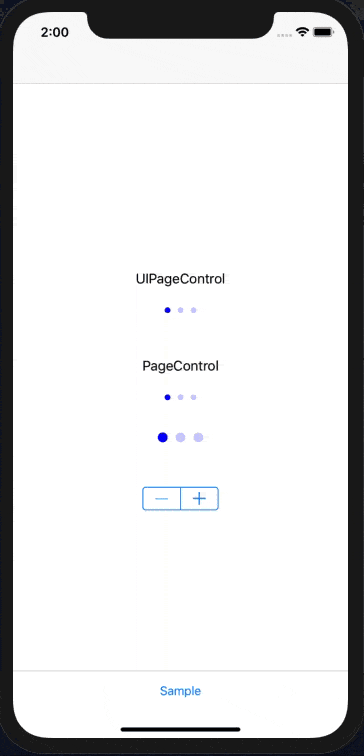

AdventCalendar2018
=====

AdventCalendar2018 is a sample code for the dely, Inc. [advent calendar2018](https://adventar.org/calendars/3535) on 12/10.  
Sample implementations for the page control and the bottom bar.

## Requirements
Xcode 10.1
iOS 11.0 (for safeArea)
Swift 4.2

## Usages
Enable to change the dot size and margin.
Use like UIPageControl.
```
let pageControl = PageControl()
pageControl.dotSize = 12.0
pageControl.dotMargin = 10.0
pageControl.numberOfPages = 3
pageControl.currentPageIndicatorTintColor = UIColor.blue
pageControl.pageIndicatorTintColor = UIColor.blue.withAlphaComponent(0.2)
```


